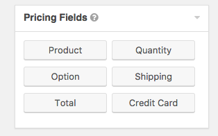
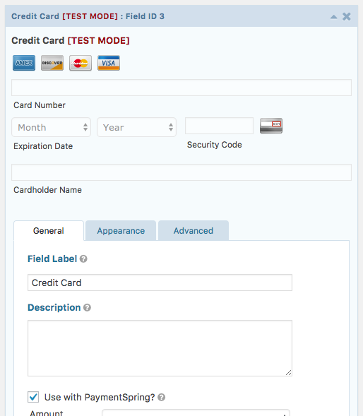
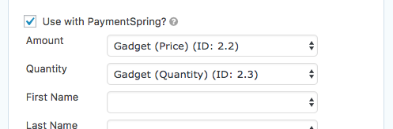
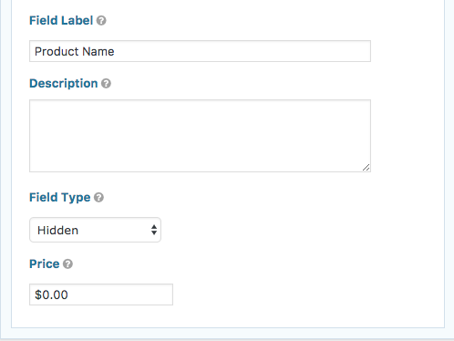
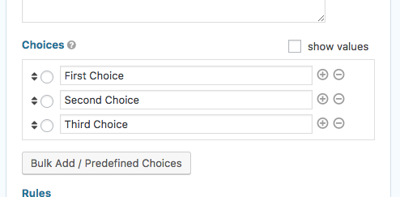
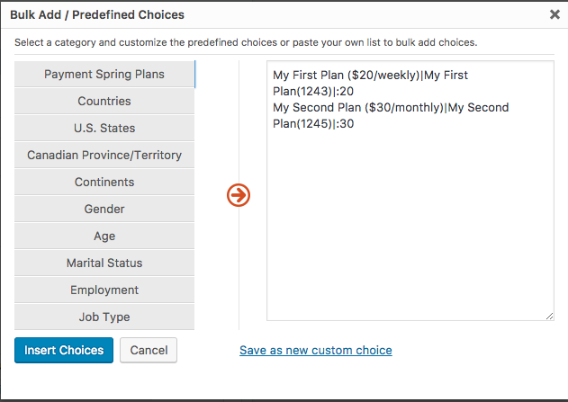
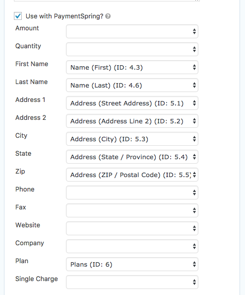
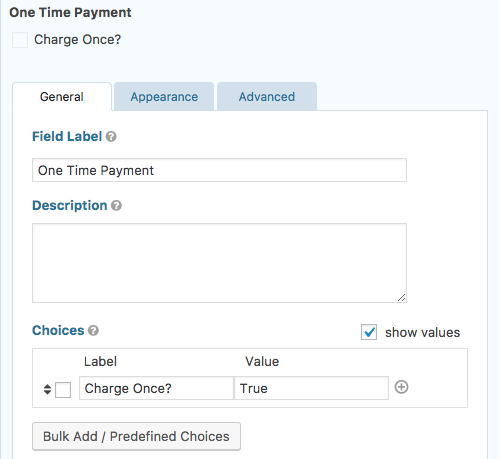
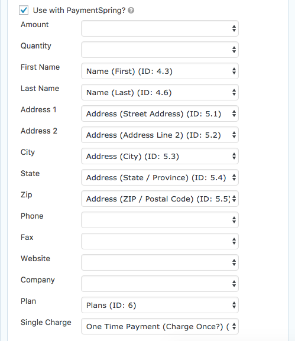

# PaymentSpring for Gravity Forms

## Description

[PaymentSpring](https://www.paymentspring.com/) is a credit card processing gateway with a developer friendly API. This plugin is officially supported by PaymentSpring and is specifically designed for use with Gravity Forms. 

PaymentSpring API keys are required.  You can obtain your own by [registering for a free PaymentSpring test account](https://www.paymentspring.com/signup). 

## Dependencies

* GravityForms (Premium plugin, purchase is required)
* WordPress 

Officially tested using WordPress 4.7.3 & GravityForms 2.1.3

## Setup
 
1. Install Gravity Forms
2. Install the PaymentSpring for GravityForms Plugin
3. Add your API Keys (Select "Forms" on the sidebar > "Settings" > "PaymentSpring")

### Going Live
To go live, be sure to select "Live" from the mode options and enter in your live API keys.

### Enabling Plans

By default, all active plans in PaymentSpring will be available for use. To disable plans, you can manage those in "Enabled Plans" in the PaymentSpring settings.

## Adding PaymentSpring to your forms

### Add the Credit Card field

When editing or creating a form, drag and drop "Credit Card" from the "Pricing Fields" section. 

Once dropped in, be sure to check "Use with PaymentSpring?" under the "General" tab.

You'll now need to specifiy the amount to charge a customer. There's three ways of accomplishing this.

***

### Single Product

To charge for a single product, drag and drop a "Product" field.

##### With Quantity

By default, the product field will allow a customer to add in a quantity. 

To hook this up with the Credit Card, set "Amount" to be the field's price and "Quantity" to be the field's quantity.

##### Without Quantity

To simply charge a customer, drag and drop in a "Product" field. This time, change "Field Type" to "Hidden."

The credit card configuration is almost the exact same as the previous step, just don't specific a "Quantity."

***

### Plans

Using plans takes a couple of steps. 

Because we need to create a customer within PaymentSpring, we need to collect their personal information. 

1. Drag and Drop a "Name" field and an "Address" field from the sidebar. Both of these are found under "Advanced Fields" on the sidebar.
2. Drag and Drop a "Drop Down" field. This will be used to pick a plan.
3. Within the "Choices" we'll need to add in our available plans. Click "Bulk Add/Predifined Choices": .     
4. At the top of the left sidebar click "PaymentSpring Plans". **Don't change anything here.** Click "Insert Choices." 
5. Now all of your fields are ready to be hooked up to your Credit Card form. It should look something like this: 

	

##### Allow One-Time Charges

Adding a "One Time Charge" field just involves one extra step. 

Add a checkbox field like this:

Your "Label" can be whatever you want, this is what the users will see. Just make sure the "Value" is set to "True"

Then set your Credit Card field accordingly:

